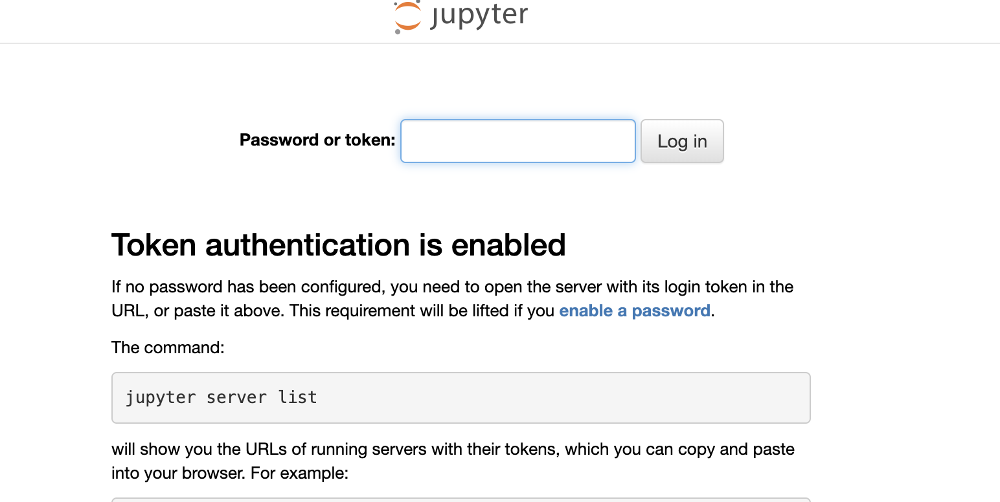
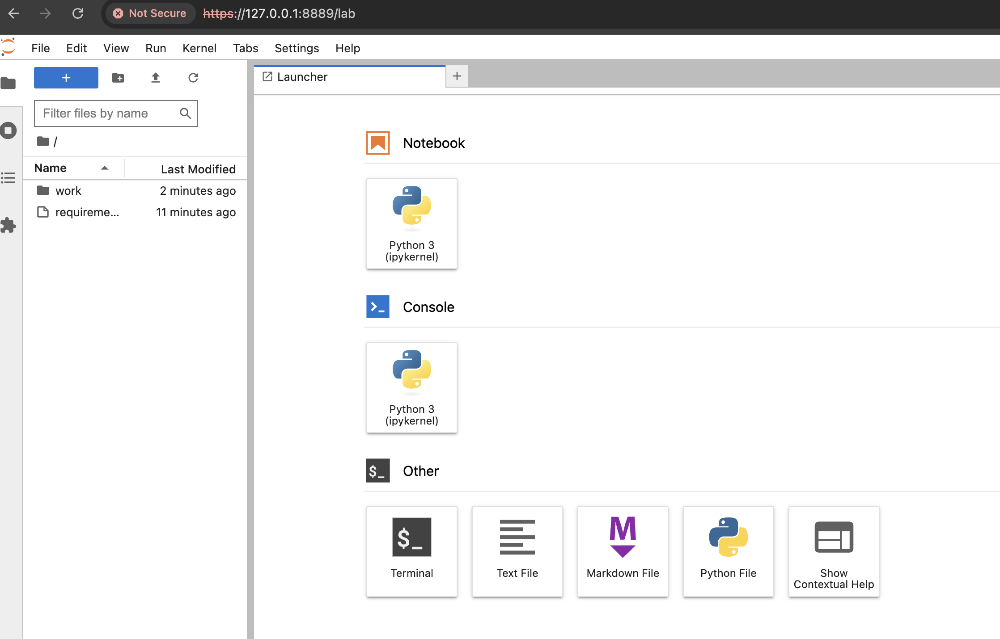

# Docker Setup for Jupyter Book

Executable books are a great way to code and document.
Seamlessly publish it as a book and host it in a website.

This repository shows how to setup a Jupyter book environment
with Docker.

1. Run setup.sh. This creates the SSL certificate needed to run jupyter lab in https.

This creates a folder called as keys and stores the certificate and key.
The path is passed as an environment variable to docker compose file.
You can setup token here in the variable $TOKEN.

2. docker compose --env-file my.env build

This will build your container image. Verify by running the following command
in your terminal.

docker images

You should see something similar to it.

  REPOSITORY            TAG       IMAGE ID       CREATED              SIZE
  jupyter-book-docker   latest    5e55ad62595c   About a minute ago   6.66GB

3. docker compose --env-file my.env up

In another terminal run the command

docker ps

You should see,

  CONTAINER ID   IMAGE                        COMMAND                  CREATED         STATUS                   PORTS                    NAMES
  ec84445dbc75   jupyter-book-docker:latest   "tini -g -- start-no…"   8 seconds ago   Up 8 seconds (healthy)   0.0.0.0:8889->8888/tcp   jupyter-book-docker-notebook-1

You are ready now to use your jupyter lab and jupyter-book.

Open your browser with https://127.0.0.1:8889

The first screen, you should enter the token you have set the environment variable $TOKEN in setup.sh. Alternateively you can open my.env to double check.

On giving the token, the home page should now open.

